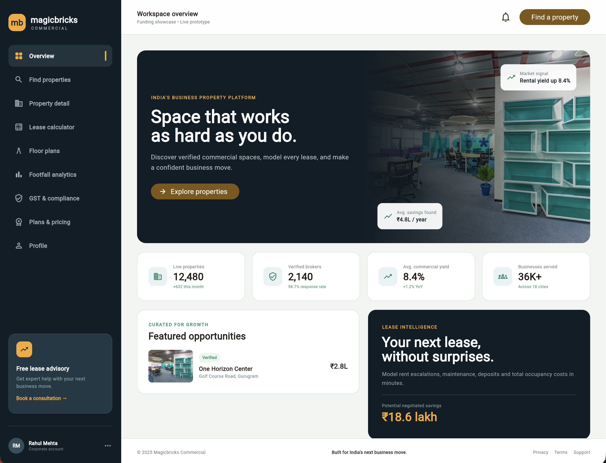
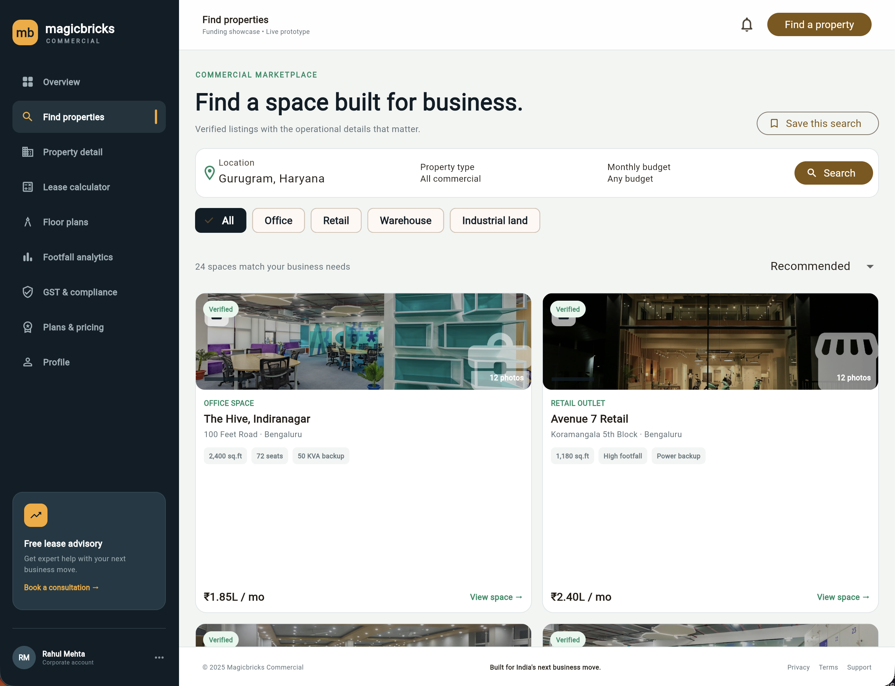
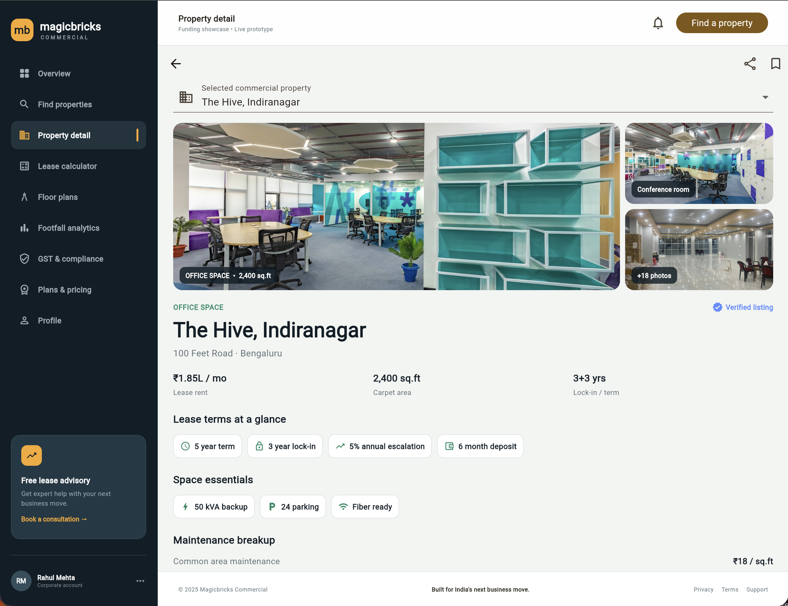
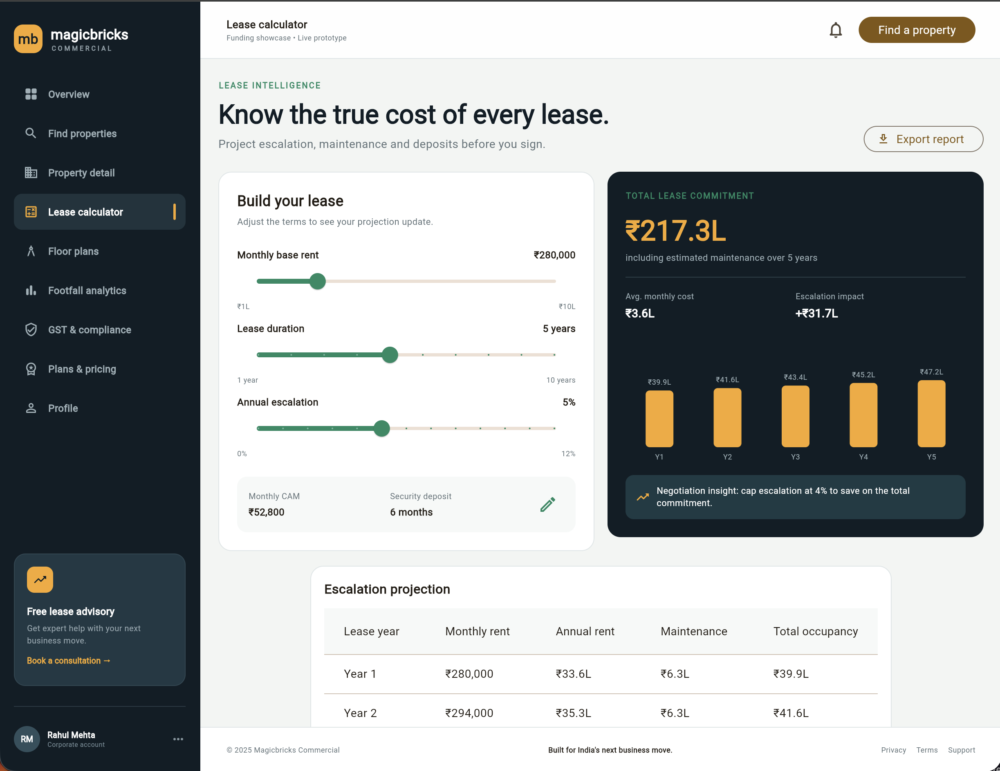
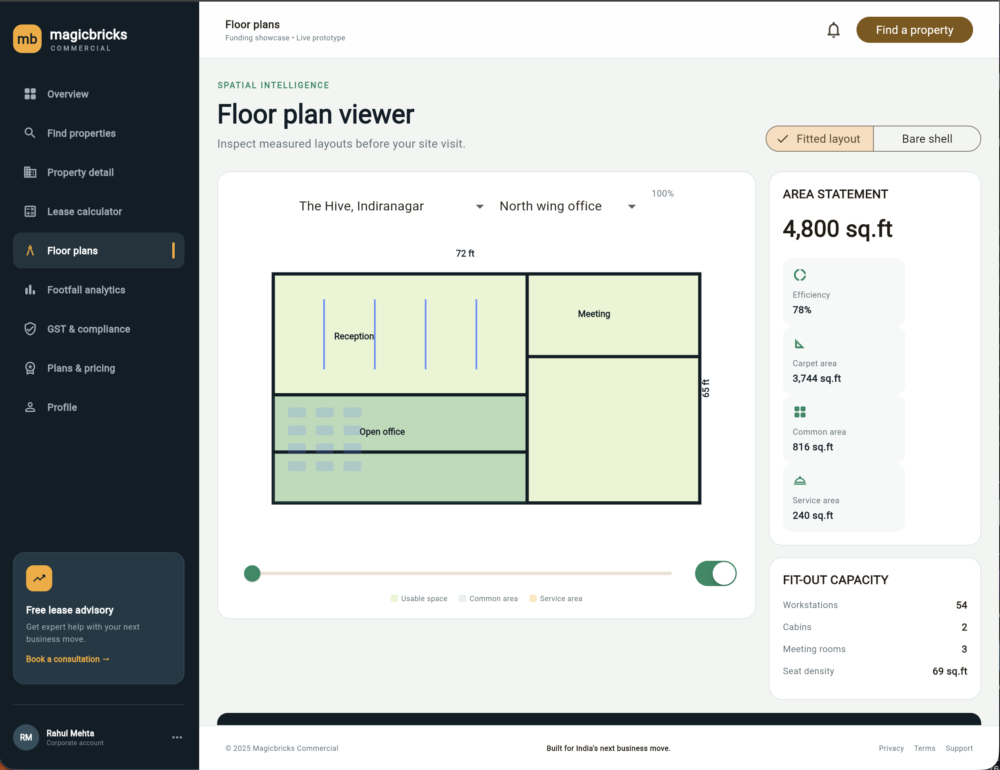
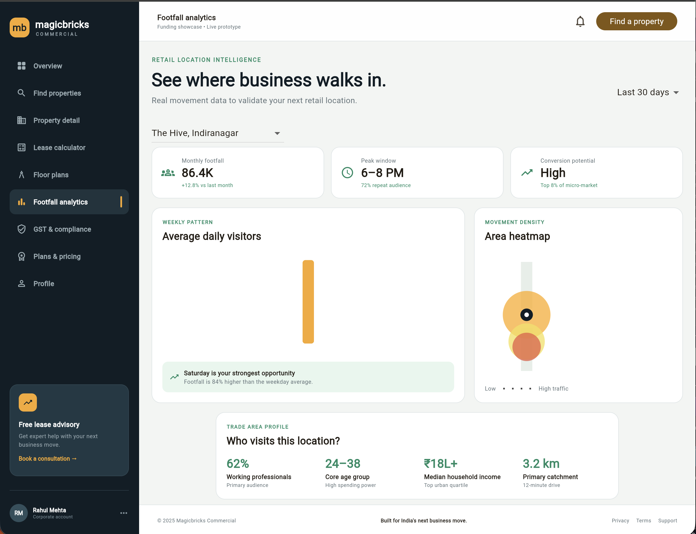
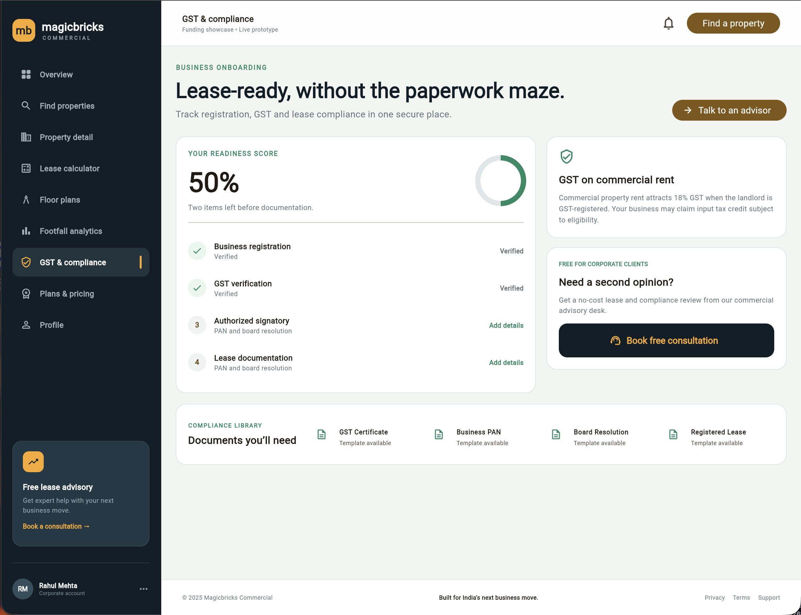
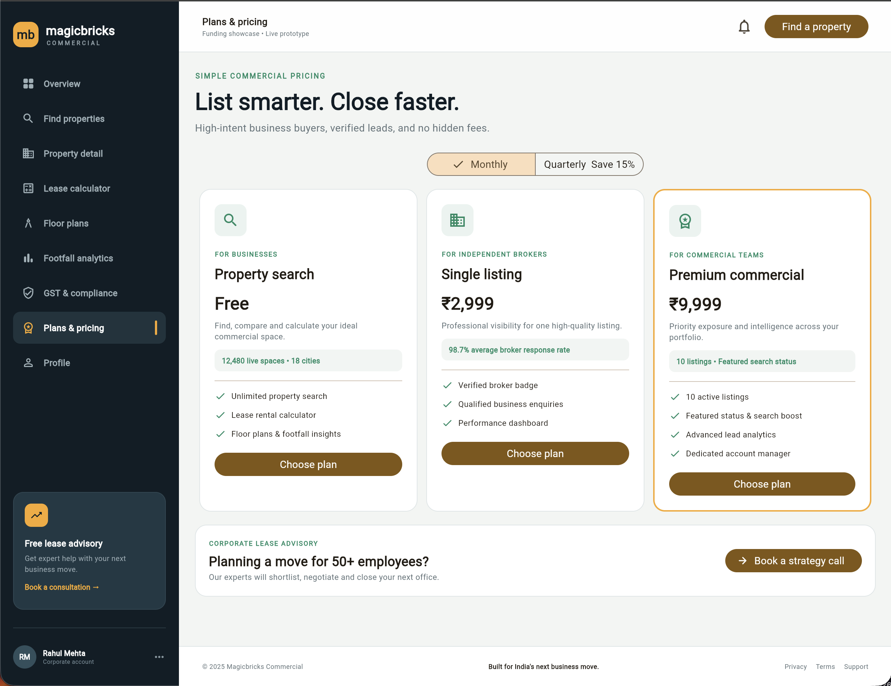
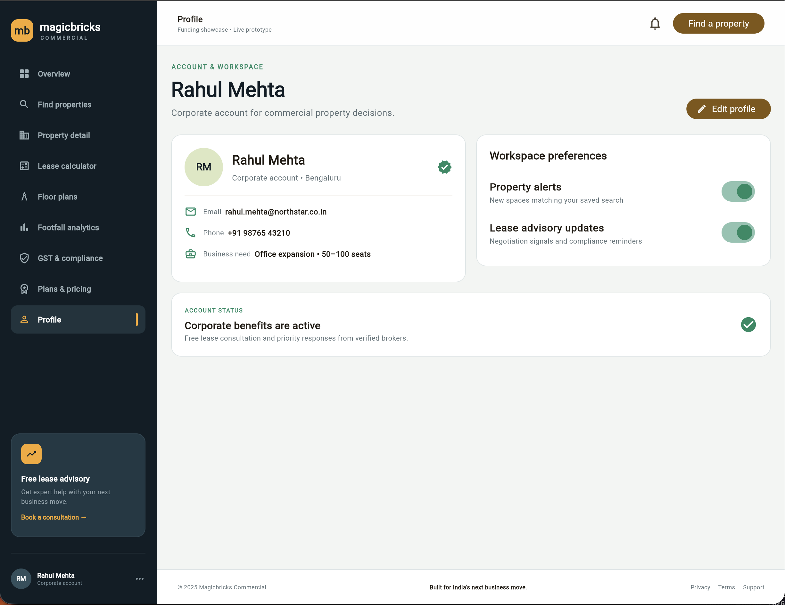

# Magicbricks Commercial
## Project Report

**Project type:** Flutter commercial real-estate management application  
**Application name:** Magicbricks Commercial  
**Platform:** Flutter with Material Design  
**Package name:** `magicbricks_commercial`

**Figma prototype:** [Open the project prototype](https://gig-cure-62236573.figma.site)

---

## 1. Introduction

Magicbricks Commercial is a responsive Flutter application designed to support commercial property discovery, evaluation, planning, and account management. The application presents commercial property information in a structured workspace suitable for business owners, property managers, and decision-makers.

The interface provides a unified navigation shell for property search, property details, lease calculations, floor-plan inspection, footfall analysis, compliance information, subscription plans, and profile management.

## 2. Objectives

- Provide a clear dashboard for commercial property workflows.
- Help users discover and compare commercial properties.
- Present property details, area statements, and fit-out capacity.
- Support lease and financial calculations.
- Provide visual floor-plan inspection with measurements.
- Display footfall and commercial analytics.
- Organize GST and compliance information.
- Provide plan and pricing information.
- Maintain a responsive layout for desktop and compact screens.

## 3. Technologies Used

- **Framework:** Flutter
- **Language:** Dart
- **UI:** Flutter Material widgets and custom widgets
- **State handling:** Stateful Flutter widgets
- **Architecture style:** Feature-based project organization
- **Platforms:** Android, iOS, Web, Linux, macOS, and Windows project targets
- **External packages:** Flutter SDK and Cupertino Icons

## 4. Application Modules

### 4.1 Overview

The overview screen acts as the main entry point and provides navigation to the major commercial-property workflows.

### 4.2 Find Properties

Users can browse commercial properties and access relevant property information from the property discovery workflow.

### 4.3 Property Details

The property detail screen presents structured information about a selected property, including its commercial characteristics and supporting details.

### 4.4 Lease Calculator

The lease calculator supports financial planning by allowing users to work with lease-related values and review calculated results.

### 4.5 Floor Plans

The floor-plan viewer displays measured layouts, room labels, dimensions, area information, and fit-out capacity. Users can switch between fitted and bare-shell layouts, adjust zoom, and show or hide dimensions.

### 4.6 Footfall Analytics

The analytics dashboard presents footfall information to help users understand activity patterns and compare visitor trends.

### 4.7 GST and Compliance

The compliance dashboard organizes GST and regulatory information relevant to commercial property operations.

### 4.8 Plans and Pricing

The plans screen presents available commercial service plans and pricing-related information.

### 4.9 Profile

The profile screen contains account information and user-specific settings.

## 5. User Interface and Navigation

The application uses a dark navigation sidebar on wider screens and a compact navigation layout on smaller screens. The main content area uses a light workspace background with highlighted cards, structured panels, and consistent action controls.

The primary navigation labels are:

1. Overview
2. Find properties
3. Property detail
4. Lease calculator
5. Floor plans
6. Footfall analytics
7. GST & compliance
8. Plans & pricing
9. Profile

## 6. Floor Plan Viewer Implementation

The floor-plan viewer is implemented with a custom painter. The painter draws:

- The outer floor-plan rectangle.
- Internal room divisions.
- Reception, open-office, and meeting areas.
- Fitted-office desks.
- Width and depth measurements.
- A vertically oriented `65 ft` depth measurement outside the right edge of the rectangle.
- A legend for usable, common, and service areas.

The floor-plan screen also includes an interactive viewer and a zoom slider. The selected room is visually emphasized with a highlight color.

## 7. Project Structure

```text
lib/
  main.dart
  core/
    app_theme.dart
  data/
    property_data.dart
  models/
    property.dart
  features/
    calculator/
    home/
    profile/
    property/
    reference/
    saved/
    tools/
  shared/
    widgets/
```

The feature-based structure keeps related screens together and separates application theme, data, models, and reusable widgets.

## 8. Testing and Validation

The project includes Flutter widget tests in the `test/` directory. The edited floor-plan file was analyzed with Flutter analysis during development. The floor-plan measurement update was also applied successfully through Flutter hot reload.

Recommended validation steps:

```bash
flutter pub get
flutter analyze
flutter test
flutter run -d chrome
```

## 9. Screenshots

### Screenshot 1: Overview Dashboard



The overview dashboard presents the main commercial-property workspace, market indicators, featured opportunities, and lease intelligence.

---

### Screenshot 2: Find Properties



The find-properties screen supports location, property-type, and budget filtering before displaying recommended listings.

---

### Screenshot 3: Property Details



The property-details screen presents the selected property gallery, rent, carpet area, lease terms, amenities, and maintenance information.

---

### Screenshot 4: Lease Calculator



The lease calculator models rent, lease duration, annual escalation, maintenance, security deposit, and total lease commitment.

---

### Screenshot 5: Floor Plan Viewer



The floor-plan viewer shows the measured office layout, room divisions, fit-out capacity, and the visible `65 ft` right-side measurement.

---

### Screenshot 6: Footfall Analytics



The footfall dashboard displays monthly visitors, peak visiting hours, conversion potential, daily visitor patterns, and area density.

---

### Screenshot 7: GST and Compliance



The compliance screen tracks business readiness, GST verification, required documents, and access to lease advisory support.

---

### Screenshot 8: Plans and Pricing



The plans screen compares property search, broker listing, and premium commercial subscription options.

---

### Screenshot 9: Profile



The profile screen presents the corporate account, contact details, business needs, workspace preferences, and account status.

---

## 10. Conclusion

Magicbricks Commercial provides a consolidated interface for commercial property workflows. Its feature-based Flutter structure supports maintainability, while the responsive navigation and custom floor-plan visualization make the application suitable for both desktop and compact layouts.

The project can be extended with backend data services, authentication, persistent saved properties, live market data, and production-ready analytics integrations.
